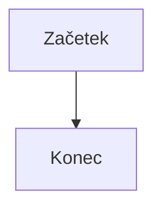

---
tags:
  - cheatsheet
---

# Markdown: povezave in struktura

Nazaj na [[00 Kazalo|Kazalo]]. Prej: [[02 Markdown - osnove|osnove]].

## Povezave, slike in vgradnje

- `[[Zapisek]]`: povezava na zapisek (`[[Mapa/Zapisek]]` z mapo).
- `[[Zapisek#Naslov]]`: povezava na naslov v zapisku, `[[#Naslov]]` na naslov v istem zapisku.
- `[[Zapisek|prikazano besedilo]]`: povezava z drugim imenom.
- `[[Zapisek#^id]]`: povezava na blok. Blok dobi ID, če na konec odstavka dodaš presledek, `^` in ime (samo latinske črke, številke, vezaji), npr. `Besedilo. ^izrek-1`. Za sezname, citate, okvirje in tabele daš ID na svojo vrstico s prazno vrstico pred in po. Ko v povezavi vtipkaš `^`, ti Obsidian ponudi seznam blokov.
- `[besedilo](https://primer.si)`: zunanja povezava. Za zapisek v Markdown zapisu: `[besedilo](Ime%20zapiska.md)`.
- `![[slika.png]]`: vgradi sliko, `![[slika.png|300]]` s širino 300, `![[slika.png|300x200]]` s širino in višino.
- ``: slika s spleta z velikostjo.
- `![[Zapisek]]`: vgradi cel zapisek, `![[Zapisek#^id]]` samo blok.
- `![[dokument.pdf#page=3]]`: PDF na tretji strani, `![[dokument.pdf#height=400]]` z višino 400.

## Tabele

```md
| Ime | Vrednost |
| --- | -------- |
| a   | 1        |
| b   | 2        |
```

Poravnavo določiš z `:` v ločilni vrstici (levo, sredina, desno):

```md
| Levo | Sredina | Desno |
| :--- | :-----: | ----: |
| a    |    b    |     c |
```

- Ločilna vrstica potrebuje vsaj dva pomišljaja v vsakem stolpcu. Presledki za poravnavo niso nujni.
- V celicah deluje oblikovanje, povezave in slike.
- Povezava ali slika z `|` v celici: pred `|` daj backslash, npr. `[[Zapisek\|besedilo]]`.
- V formulah v tabeli ne uporabljaj znaka `|`. Namesto njega napiši `\vert` ali `\mid`.
- V pogledu urejanja (Live Preview) z desnim klikom na tabelo dodaš ali brišeš vrstice in stolpce, tabelo razvrstiš in nastaviš poravnavo.

## Koda in diagrami

- Koda v vrstici: besedilo obdaš z enim backtickom `` `tako` ``.
- Blok kode: tri backticks, ime jezika (npr. python, java, sql), koda, in tri backticks v novi vrstici. Enako deluje blok s `~~~`, zamik 4 presledkov ali `Tab` pa je tudi koda.

````md
```python
for i in range(3):
    print(i)
```
````

Če v blok kode zapišeš sam blok kode, mora imeti zunanja ograja več backticks kot notranja (kot zgoraj).

Diagram dobiš z jezikom `mermaid`:

````md

````

## Opombe in komentarji

```md
Besedilo z opombo[^1].

[^1]: Besedilo opombe.

Vrstična opomba^[besedilo opombe] se izriše samo v pogledu branja.

Besedilo %%skriti komentar%% naprej.

%%
Večvrstični komentar
%%
```

## Oznake in lastnosti

- **Oznaka:** `#oznaka`. Dovoljene so črke, številke, `_`, `-` in `/`, presledki pa ne (piši `#moja_oznaka` ali `#mojaOznaka`).
- Oznaka ne sme biti samo številka: `#2024` ne, `#leto2024` da.
- Gnezdenje s poševnico: `#matematika/analiza`. Velike in male črke so enake.
- **Lastnosti (properties)** so blok na samem začetku zapiska. Tam je `---` ograda in ne črta:

```md
---
tags:
  - matematika
  - indukcija
aliases:
  - dokaz z indukcijo
---
```

## Matematika v zapisku

```md
V vrstici: $e^{i\pi} = -1$

V svojem bloku:

$$
\int_0^1 x^2 \, dx = \frac{1}{3}
$$
```

Snippeti za hitro pisanje formul so v zapiskih [[04 Latex Suite - osnove|Latex Suite]].
