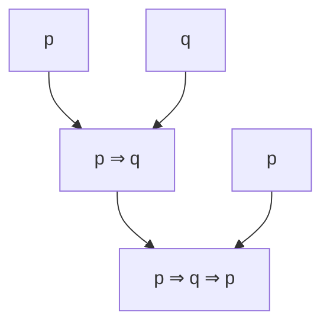

**user**: tukaj sem sedaj napisal snov.  sedaj popravi slogovne in razne napake.  in lahko spremniš še kaj da bo bolj berljivo.
[Timestamp: 2026/10/10 11:29:56]

**ai**: Zapisek [[nastanek računalnika]] je popravljen: tipkarske in pravopisne napake, vejice, velike začetnice in nezaključene krepke oznake (`**operandi`, `**pomnilnik`, `**program`).

Na treh mestih sem posegel v vsebino oziroma ugibal, kaj si mislil, zato jih preveri:

- **Točka 2 v Volume 6:** pisalo je »naj bodo *računalniki* shranjeni v enem delu računalnika«. Spremenil sem v »*ukazi* naj bodo shranjeni …«, ker je to edino smiselno glede na točko 3.
- **Točka 1 v Volume 6:** »ođičwnja« sem prebral kot »ožičenja«.
- **Naslovi:** »in a word of a genius« sem spremenil v »in the words of a genius«, »to smart to exit« v »too smart to exit«, pri Volume 1 pa sem odstranil odvečni »da« na koncu.

Za boljšo berljivost sem spremenil še to:

- Vprašanja v Volume 5 so zdaj cele povedi z vprašaji, z uvodno vrstico nad seznamom.
- Poudarek z velikimi črkami (»TOREJ PODATEK O LOKACIJI …«) je zdaj callout `[!important]` pod seznamom.
- Puščice `<-` v Volume 6 sem prepisal v običajne stavke.
- Pri centralni procesni enoti sem dodal kratici CPE in CPU.
- Med razdelki so prazne vrstice, naslovi »Volume« pa so ostali.
[Timestamp: 2026/10/10 11:29:56]

**user**: sedaj naredi isto in za zadnji volume uporabi plugine ki jih imam nameščene/aktivirane  lahko pogledaš zapsike od matematike ali DS
[Timestamp: 2026/10/10 12:02:06]

**ai**: Novi del zapiska [[nastanek računalnika]] je popravljen: točke 6–10 v Volume 6 in celoten Volume 7, ki je zdaj zapisan v LaTeXu v enakem slogu kot [[množice števil]] (bločne formule, `align`, decimalna vejica `0{,}5`).

Od vtičnikov imaš aktivirane samo Latex Suite, CalcTeX, Git in Copilot, zato sem uporabil LaTeX. Excalidraw, Desmos in ostali so nameščeni, a izklopljeni, zato jih nisem uporabil. V [[predavanje 1]] pri DS je samo naslov, tako da sem se zgledoval le po matematiki.

Preveri ta mesta, kjer sem ugibal ali kaj dodal:

- **Zgleda 1 in 2:** bila sta prazna, zato sem ju izračunal sam: $S(1000) \approx 1{,}998$ pri $f = 0{,}5$ in $S(1000) \approx 9{,}91$ pri $f = 0{,}9$.
- **Limita:** dodal sem callout z zgornjo mejo $\frac{1}{1-f}$, ki je v tvojem zapisku ni bilo. Če je na predavanju niste omenili, ga izbriši.
- **Skica programa:** tvoji črtni skici `|--f--|--1-f--|` sem zamenjal z dvema formulama z oznakami pod členi (»se pohitri«, »ostane«).
- **Ime:** »Ahmdol« sem popravil v Amdahl.
- **Točka 9:** pisalo je »dobi *operacijo* iz zunanjega sveta«; zapisal sem »podatke dobi iz zunanjega sveta in jih v zunanji svet tudi pošlje«.
- **Naslov Volume 7:** »na IQ to high« sem spremenil v »IQ too high«, ker besede »na« nisem razumel.
- **Kratice:** dodal sem PC pri programskem števcu in ALE pri aritmetično-logični enoti.
[Timestamp: 2026/10/10 12:02:06]

**user**: za izgleda izlušči še ugotovitev
[Timestamp: 2026/10/10 12:02:45]

**ai**: Na konec zapiska [[nastanek računalnika]] sem dodal razdelek »Ugotovitev«, ki povzame oba zgleda:

- **Tabela:** za vsak zgled primerja $f$, $N$, dobljeno pohitritev $S(N)$ in zgornjo mejo $\frac{1}{1-f}$.
- **Ne dobimo $N$-kratne pohitritve:** s 1000 računalniki je program le $2$-krat oziroma $10$-krat hitrejši.
- **Odloča $f$, ne $N$:** pohitritev omejuje del programa $1 - f$, ki ga ne moremo pohitriti.
- **Smo že skoraj na meji:** v obeh zgledih dodajanje računalnikov ne pomaga več.
- **Sklep v calloutu:** bolj se splača povečati delež programa, ki ga lahko pohitrimo, kot dodajati računalnike.

Ugotovitev sem izpeljal sam iz obeh izračunov, zato jo primerjaj s tem, kar ste zapisali na predavanju.

Popravil sem tudi svojo napako iz prejšnjega koraka: v izračunih obeh zgledov je bil na koncu vrstic en sam `\` namesto `\\`, zato se enačbe niso prelomile v vrstice. Zdaj je prav.
[Timestamp: 2026/10/10 12:02:45]

**user**: povej mi kako dobim ta znak za negacijo in vse ostale za te stvari in dodaj to odzadi še drugim
[Timestamp: 2026/10/10 13:20:30]

**ai**: Preveril sem, katere bližnjice ima tvoj Latex Suite; zdaj dodajam znake še ostalim veznikom v zapisku.Znake pišeš v matematičnem načinu (med `$ … $`) z ukazi LaTeX; v [[izjave in izjavni vezniki]] sem jih dodal na konec vsake vrstice z vezniki.

| Veznik | Znak | Ukaz | Bližnjica v Latex Suite |
|-|-|-|-|
| negacija | $\neg p$ | `\neg p` | ni |
| konjunkcija | $p \land q$ | `p \land q` | ni |
| disjunkcija | $p \lor q$ | `p \lor q` | ni |
| ekskluzivna disjunkcija | $p \oplus q$ | `p \oplus q` | `o+` |
| implikacija | $p \implies q$ | `p \implies q` | `=>` |
| ekvivalenca | $p \iff q$ | `p \iff q` | ni |

Bližnjice sem preveril v privzetih nastavitvah tvojega Latex Suite: obstajata samo `o+` in `=>`, ostale ukaze moraš vpisati v celoti. Pazi, bližnjici `and` in `orr` dasta množična znaka $\cap$ in $\cup$, ne logičnih $\land$ in $\lor$.

V zapisku preveri dvoje:

- **Črki:** tvoj »¬f« sem zamenjal z $\neg p$ in povsod uporabil $p$ in $q$. Če na predavanjih uporabljate druge črke, jih zamenjaj.
- **Znaki:** za ekskluzivno disjunkcijo sem izbral $\oplus$, nekateri profesorji pišejo $\veebar$ (`\veebar`). Za implikacijo in ekvivalenco sem uporabil dvojni puščici; če pišete enojni, sta ukaza `\to` (bližnjica `->`) in `\leftrightarrow` (bližnjica `<->`).

Lastne bližnjice za `\neg`, `\land`, `\lor` in `\iff` se da dodati v nastavitvah Latex Suite pod »Snippets«.
[Timestamp: 2026/10/10 13:20:30]

**user**: dodaj to v bljižnice
[Timestamp: 2026/10/10 13:27:11]

**ai**: 
[Timestamp: 2026/10/10 13:27:11]

**user**: tisto tabelo v mapo bljižnice
[Timestamp: 2026/10/10 13:27:25]

**ai**: Tabelo sem dodal v mapo Bližnjice, na konec zapiska [[05 Latex Suite - simboli]], kot nov razdelek »Logika: izjavni vezniki«.

- **Oblika:** stolpci so veznik, kaj vpišeš, koda in videz, tako kot v ostalih tabelah tam.
- **Ekskluzivna disjunkcija:** vpisal sem oba zapisa, `\veebar` (ki ga zdaj uporabljaš v zapisku) in `\oplus` z bližnjico `o+`.
- **Opozorilo:** pod tabelo je callout, da `and` in `orr` dasta $\cap$ in $\cup$, ne $\land$ in $\lor$.
- **Kazalo:** v [[00 Kazalo]] sem pri opisu tega zapiska dodal besedo »logika«.
[Timestamp: 2026/10/10 13:27:25]

**user**: naredi pod negacijo pravilnostno tabelo v tej datoteki
[Timestamp: 2026/10/10 13:29:08]

**ai**: Pravilnostna tabela je dodana pod razdelek »negacija« v [[izjave in izjavni vezniki]]:

| $A$ | $\neg A$ |
|:-:|:-:|
| $0$ | $1$ |
| $1$ | $0$ |

Uporabil sem $1$ za resnično in $0$ za neresnično, kot imaš zapisano zgoraj v zapisku.

Pri tem sem opazil napako v 6. vrstici, ki je nisem popravljal: piše »*resnične (1)* in *neresnične(1)*«, pri neresničnih bi morala biti (0).
[Timestamp: 2026/10/10 13:29:08]

**user**: ali je kakšna bljižnica za dati tabelo v dat
[Timestamp: 2026/10/10 13:29:48]

**ai**: Privzete bližnjice za tabelo Obsidian nima, lahko pa jo vstaviš z ukazom in si bližnjico nastaviš sam.

- **Ukaz:** pritisni `Ctrl+P`, vpiši `Insert table` in potrdi z `Enter`. Vstavi se prazna tabela 2×2, s `Tab` skačeš v naslednjo celico, z `Enter` v naslednjo vrstico.
- **Lastna bližnjica:** v **Settings → Hotkeys** poišči `Insert table` in ji dodeli kombinacijo, npr. `Ctrl+Shift+T`.
- **Desni klik:** v zapisku izberi **Insert → Table**. Z desnim klikom na obstoječo tabelo dodajaš in brišeš vrstice ter stolpce.

Imaš tudi nameščen, a izklopljen vtičnik Advanced Tables (`table-editor-obsidian`). Če ga vklopiš, napišeš samo `| A | ¬A` in pritisneš `Tab`, pa se tabela sama naredi in poravna.
[Timestamp: 2026/10/10 13:29:48]

**user**: tisto z | ne dela
[Timestamp: 2026/10/10 13:47:31]

**ai**: Vtičnik Advanced Tables imaš zdaj vklopljen in `Tab` je v njegovih nastavitvah vezan na tabele, tako da bi moralo delati. Kaj točno si vtipkal, ne vidim, zato so to najverjetnejši vzroki:

1. **Kazalec je v formuli.** Če napišeš `| $A$ | $\neg A$` in pritisneš `Tab`, ko je kazalec še med `$ … $`, ga prestreže Latex Suite in te samo vrže iz formule. Pritisni `Tab` še enkrat, ko si zunaj formule, ali pa najprej naredi tabelo z navadnim besedilom in formule vpiši potem.
2. **Vrstica se ne začne z `|`.** Pred prvim `|` ne sme biti besedila ali alineje (`-`), nad vrstico pa naj bo prazna vrstica.
3. **Vtičnik se še ni naložil.** Če si ga vklopil tik pred tem, zapri in ponovno odpri Obsidian (ali `Ctrl+P` → `Reload app without saving`).

Preizkusi v prazni vrstici brez formul:

```md
| A | B
```

S kazalcem na koncu vrstice pritisni `Tab`. Dobiti moraš glavo tabele z ločilno vrstico pod njo.

Če še vedno ne dela, uporabi `Ctrl+P` → `Insert table`, ki dela neodvisno od vtičnika. Povej mi, kaj točno si vtipkal in kaj se je zgodilo ob `Tab`, pa bom pogledal naprej.
[Timestamp: 2026/10/10 13:47:31]

**user**: napiši hirearhijo z > znaki in nato še vsako z svojimi znaki in oklepaji
[Timestamp: 2026/10/10 13:54:36]

**ai**: V razdelek »dogovorno opuščanje oklepajev« v [[izjave in izjavni vezniki]] sem dopisal hierarhijo in primere z oklepaji za vsa tri pravila.

Hierarhija je zapisana tako (levo veže najmočneje):

$$
\neg \;>\; \land \;>\; \lor,\ \veebar \;>\; \implies \;>\; \iff
$$

- **Pravilo 1 (hierarhija):** en dolg primer z vsemi vezniki in tabela, ki za vsak par sosednjih ravni pokaže, kam gredo oklepaji, npr. $A \land B \lor C = (A \land B) \lor C$.
- **Pravilo 2 (ista vrsta):** tabela za vsak veznik posebej, npr. $A \implies B \implies C = (A \implies B) \implies C$.
- **Pravilo 3 (disjunkciji):** $\lor$ in $\veebar$ sta na isti ravni, npr. $A \lor B \veebar C = (A \lor B) \veebar C$.

Vrstni red hierarhije sem zapisal po spominu na običajni dogovor, ker je bila tvoja vrstica prazna, zato ga primerjaj s tablo. Posebej preveri dvoje:

- **Raven $\veebar$:** dal sem jo na isto raven kot $\lor$, kar sem sklepal iz tvojega tretjega pravila.
- **Implikacija od leve proti desni:** $A \implies B \implies C$ sem po tvojem drugem pravilu zapisal kot $(A \implies B) \implies C$. Nekateri učbeniki jo združujejo z desne.
[Timestamp: 2026/10/10 13:54:36]

**user**: naredi tukaj konstrukcisko drevo tako da rata spodnji izraz
[Timestamp: 2026/10/10 14:05:30]

**ai**: Namesto vrstice »p q p« je v [[izjave in izjavni vezniki]] zdaj konstrukcijsko drevo za izraz $p \implies q \implies p$, narisano kot Mermaid diagram (Obsidian ga izriše sam, brez vtičnika). Izrisa v Obsidianu nisem mogel preveriti, zato poglej, ali so listi lepo v zgornji vrsti.



- **Zgradba:** zgoraj so listi $p$, $q$, $p$; prva dva se združita v $p \implies q$, ta pa z drugim $p$ v končni izraz. To se ujema s tvojo vrstico spodaj, da $q \implies p$ v izrazu ne nastopa.
- **Dolžina in globina:** drevo ima 5 vozlišč (3 spremenljivke + 2 veznika) in globino 2. Tega v zapisek nisem dopisal.
- **Znak:** v diagramu je `⇒` vpisan kot navaden znak, ker Mermaid ne izriše LaTeXa (`$\implies$`).
[Timestamp: 2026/10/10 14:05:30]

**user**: naredi resničnostno tabelo za ta izraz ker meni se je neda prepisat iz zvezka
[Timestamp: 2026/10/10 14:10:31]

**ai**: Tvojo vrstico s stolpci sem v [[izjave in izjavni vezniki]] zamenjal z resničnostno tabelo za $q \land (p \implies (\neg r))$. Vrednosti sem izračunal sam, zato jih lahko primerjaš z zvezkom:

| $p$ | $q$ | $r$ | $\neg r$ | $p \implies \neg r$ | $q \land (p \implies (\neg r))$ |
| :-: | :-: | :-: | :-: | :-: | :-: |
| 0 | 0 | 0 | 1 | 1 | 0 |
| 0 | 0 | 1 | 0 | 1 | 0 |
| 0 | 1 | 0 | 1 | 1 | 1 |
| 0 | 1 | 1 | 0 | 1 | 1 |
| 1 | 0 | 0 | 1 | 1 | 0 |
| 1 | 0 | 1 | 0 | 0 | 0 |
| 1 | 1 | 0 | 1 | 1 | 1 |
| 1 | 1 | 1 | 0 | 0 | 0 |

Vrstice so urejene od 000 do 111; če ste jih na predavanju pisali v obratnem vrstnem redu (od 111 navzdol), povej in jih obrnem.
[Timestamp: 2026/10/10 14:10:31]

**user**: ali lahko kamor sem dal | narediš malo bolj močno črto
[Timestamp: 2026/10/10 14:11:04]

**ai**: Tabelo v [[izjave in izjavni vezniki]] sem prepisal v LaTeX, tako da sta navpični črti samo tam, kjer si imel `|`: za stolpcem $r$ in pred končnim izrazom. Izrisa v Obsidianu nisem mogel preveriti.

Navadna Markdown tabela ne zna poudariti posamezne črte, zato sem uporabil okolje `array`. Črte določa vrstica `{ccc|cc|c}`: vsak `c` je en stolpec, `|` pa črta med njima. Vrednosti so enake kot prej.

$$
\begin{array}{ccc|cc|c}
p & q & r & \neg r & p \implies \neg r & q \land (p \implies (\neg r)) \\
\hline
0 & 0 & 0 & 1 & 1 & 0 \\
0 & 0 & 1 & 0 & 1 & 0 \\
0 & 1 & 0 & 1 & 1 & 1 \\
0 & 1 & 1 & 0 & 1 & 1 \\
1 & 0 & 0 & 1 & 1 & 0 \\
1 & 0 & 1 & 0 & 0 & 0 \\
1 & 1 & 0 & 1 & 1 & 1 \\
1 & 1 & 1 & 0 & 0 & 0
\end{array}
$$

Slabost je, da tabele ne moreš več urejati s klikanjem po celicah, ampak samo v kodi. Če želiš dvojno črto, zamenjaj `|` z `||`.
[Timestamp: 2026/10/10 14:11:04]

**user**: kako se naredi tisto vijugo za enakovredna izraza
[Timestamp: 2026/10/10 14:18:58]

**ai**: Vijuga za enakovredna izraza je `\sim`, v Latex Suite pa jo dobiš z bližnjico `simm` (znotraj formule):

| Vpiši | Koda | Videz |
|-|-|-|
| `simm` | `A \sim B` | $A \sim B$ |

Če ste na predavanju pisali kak drug znak, so to najpogostejše različice:

| Vpiši | Koda | Videz |
|-|-|-|
| `sim=` | `A \simeq B` | $A \simeq B$ |
| `\approx` | `A \approx B` | $A \approx B$ |
| `===` | `A \equiv B` | $A \equiv B$ |

Bližnjice `simm`, `sim=` in `===` so že zapisane v [[05 Latex Suite - simboli]]; `\approx` nima bližnjice, zato jo vtipkaš v celoti.
[Timestamp: 2026/10/10 14:18:58]

**user**: olepšaj še sedaj malo te zapiske.  ampak ne preveč kakor lako vidiš sem od prej ko si ustavil tiste tabele jih izbrisal na primer.   

še za dva izraza moraš narediti pravilnostno tabelo, saj jih boš videl.
[Timestamp: 2026/10/10 14:24:02]

**ai**: Zapisek [[izjave in izjavni vezniki]] je urejen in obe manjkajoči pravilnostni tabeli sta dodani; novih razlag ali dodatnih tabel nisem dodajal. Izrisa v Obsidianu nisem mogel preveriti.

**Novi tabeli** (vrednosti sem izračunal sam, v enaki obliki s črto kot prejšnja):
- $(p \implies q) \lor (\neg q \implies p)$: v vseh štirih vrsticah je 1, torej je tavtologija. Obdržal sem tvojo postavitev `p q | izraz`, brez vmesnih stolpcev.
- $\neg p \lor q$ in $p \implies q$: stolpca sta enaka (1, 1, 0, 1), zato sta izraza enakovredna.

**Kaj sem olepšal:**
- **Zakoni izjavnega računa:** prilepljeno besedilo je imelo pokvarjene znake (`^`, `_`, `,`, `⇠`). Prepisal sem jih v $\land$, $\lor$, $\iff$, $\sim$ in razdelil v oštevilčen seznam.
- **Pravopis in oblika:** tipkarske napake, vejice, velike začetnice v naslovih, vse tabele veznikov v enaki obliki, branja implikacije in ekvivalence kot alineje.
- **Naslovi:** dodal sem tri podnaslove (»Resničnostna tabela«, »Tavtologija, protislovje, nevtralni izrazi«, »Enakovredni izrazi«), da spodnji del ni en sam blok.

**Vsebinski popravki, ki jih preveri:**
- »neresnične(1)« sem popravil v (0), »tavtografija« v tavtologija, »nevrtalni« v nevtralni, »protislovje je vedno negativen« v »vedno neresničen«.
- Pri izjavnih izrazih je pisalo »potem so tudi vsi iz njih izjavni izrazi«; izpisal sem jih: $A \land B$, $A \lor B$, $A \veebar B$, $A \implies B$, $A \iff B$.
- Pri globini je pisalo »je dolžina drevesa«; zapisal sem »višina drevesa«.

**Kar je ostalo nedokončano, ker v zapisku ni bilo podatka:**
- Pri ekskluzivni disjunkciji manjka, kako se bere (za »beremo« je prazno).
- Pri dvomestnih in tromestnih veznikih ni primerov.
[Timestamp: 2026/10/10 14:24:02]

**user**: tukaj dokončaj
[Timestamp: 2026/10/10 14:26:16]

**ai**: Stavek pri ekskluzivni disjunkciji v [[izjave in izjavni vezniki]] je dokončan: »… označimo z $A \veebar B$ in beremo »ali A ali B«.«

To je običajno branje za ekskluzivno disjunkcijo (resnična je, ko je resnična natanko ena od izjav); če ste na predavanju rekli drugače, ga zamenjaj.
[Timestamp: 2026/10/10 14:26:16]

**user**: še to napiši še pri ostalih
[Timestamp: 2026/10/10 14:26:58]

**ai**: V [[izjave in izjavni vezniki]] ima zdaj vsak veznik pred tabelo stavek o tem, kdaj je resničen, tako kot negacija:

- **Konjunkcija:** $A \land B$ je resnična natanko takrat, ko sta $A$ in $B$ obe resnični.
- **Disjunkcija:** $A \lor B$ je resnična natanko takrat, ko je resnična vsaj ena od izjav $A$ in $B$.
- **Ekskluzivna disjunkcija:** $A \veebar B$ je resnična natanko takrat, ko je resnična natanko ena od izjav $A$ in $B$.
- **Implikacija:** $A \implies B$ je neresnična natanko takrat, ko je $A$ resnična in $B$ neresnična.
- **Ekvivalenca:** $A \iff B$ je resnična natanko takrat, ko imata $A$ in $B$ isto logično vrednost.

Pri implikaciji sem stavek namenoma obrnil na »neresnična«, ker je tako krajše in se ujema s tvojim opisom zgoraj v seznamu veznikov.
[Timestamp: 2026/10/10 14:26:58]

**user**: dobro sedaj pri zakonih izjavnega računa  vsak zakon malo razloži,  profesor je delal neke primerjave ki so mi bile ušeč a si jih nisem zapomnil mapak je bilo nekaj takega:   komunitativnost:  konjukcija in disjunkcija sta kot množenje ker .... ali kaj takega.
[Timestamp: 2026/10/10 14:29:08]

**ai**: V razdelku »Zakoni izjavnega računa« v [[izjave in izjavni vezniki]] ima zdaj vsak zakon pod formulami kratko razlago s primerjavo z računanjem. Primerjave so moje, ne profesorjeve, ker njegovih ne poznam; če se katere spomniš drugače, jo popravim.

Osnovna ideja, zapisana na vrhu razdelka: $\land$ se obnaša kot množenje, $\lor$ kot seštevanje, $\neg$ pa kot predznak minus.

- **Dvojna negacija:** dva minusa se izničita, $-(-x) = x$.
- **Idempotenca:** ponovitev iste izjave ne pove nič novega; pri številih to velja le za 0 in 1 pri množenju ($1 \cdot 1 = 1$).
- **Komutativnost:** vrstni red ni pomemben, kot pri $a \cdot b = b \cdot a$ in $a + b = b + a$. Implikacija ni komutativna, podobno kot odštevanje.
- **Asociativnost:** vseeno je, kje so oklepaji, kot pri $(a \cdot b) \cdot c = a \cdot (b \cdot c)$. Implikacija ni asociativna, podobno kot odštevanje.
- **Absorpcija:** $B$ je odveč, o vsem odloča $A$. Pri navadnem računanju tega zakona ni, zato je razložen z vrednostma 0 in 1.
- **Distributivnost:** prvi zakon je odpravljanje oklepajev, $(a + b) \cdot c = a \cdot c + b \cdot c$. Drugi pri številih ne velja, v logiki pa velja v obe smeri.
- **De Morgan:** negacija gre k vsakemu členu in veznik se obrne, podobno kot $-(a + b) = -a - b$. Primer: »ni res, da dežuje ali sneži« pomeni »ne dežuje in ne sneži«.
[Timestamp: 2026/10/10 14:29:08]