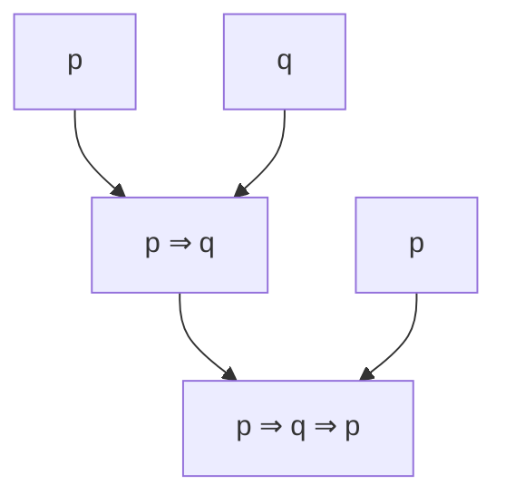

# Izjava
**Izjava** je stavek, ki je bodisi resničen bodisi neresničen.
- Zapri vrata!
- Ta stavek ni resničen! – nima logične vrednosti (resničen/neresničen), zato ni izjava
- Zunaj sveti luna. – odvisno od dejavnika

Izjave delimo na *resnične (1)* in *neresnične (0)*.

Po obliki jih delimo na:
- **osnovne** (enostavne), primer: Zunaj sije sonce.
- **sestavljene**, primer: Če zunaj sije sonce, Peter sedi na vrtu. (Podobno kot pri $2 \cdot 3 \cdot 4 = 24$, kjer so 2, 3, 4 osnovni gradniki.)

Izjave sestavljamo s pomočjo **izjavnih veznikov** (tudi izjavnih povezav, logičnih veznikov). Izjavni vezniki so:
- enomestni (npr. ne)
- dvomestni
- tromestni

Resničnost sestavljene izjave je odvisna samo od resničnosti sestavnih delov. Zato izjavne veznike definiramo s pomočjo resničnostnih tabel.
- **negacija** *nasprotje* $\neg p$
- **konjunkcija** *and* $p \land q$
- **disjunkcija** *or* $p \lor q$
- **ekskluzivna disjunkcija** *točno ena mora biti resnična* $p \veebar q$
- **implikacija** *neresnična je, ko je prvi člen resničen in drugi neresničen* $p \implies q$
- **ekvivalenca** *ko imata isto vrednost* $p \iff q$

## Negacija
Negacijo izjave $A$ označimo z $\neg A$ in beremo »ne A«.
$\neg A$ je resnična natanko takrat, ko je $A$ neresnična. Definirana je z naslednjo pravilnostno tabelo:

| $A$ | $\neg A$ |
| :-: | :------: |
|  0  |    1     |
|  1  |    0     |

## Konjunkcija
Konjunkcijo izjav $A$ in $B$ označimo z $A \land B$ in beremo »A in B«.
$A \land B$ je resnična natanko takrat, ko sta $A$ in $B$ obe resnični.

| $A$ | $B$ | $A \land B$ |
| :-: | :-: | :---------: |
|  0  |  0  |      0      |
|  0  |  1  |      0      |
|  1  |  0  |      0      |
|  1  |  1  |      1      |

## Disjunkcija
Disjunkcijo izjav $A$ in $B$ označimo z $A \lor B$ in beremo »A ali B«.
$A \lor B$ je resnična natanko takrat, ko je resnična vsaj ena od izjav $A$ in $B$.

| $A$ | $B$ | $A \lor B$ |
| :-: | :-: | :--------: |
|  0  |  0  |     0      |
|  0  |  1  |     1      |
|  1  |  0  |     1      |
|  1  |  1  |     1      |

## Ekskluzivna disjunkcija
Ekskluzivno disjunkcijo izjav $A$ in $B$ označimo z $A \veebar B$ in beremo »ali A ali B«.
$A \veebar B$ je resnična natanko takrat, ko je resnična natanko ena od izjav $A$ in $B$.

| $A$ | $B$ | $A \veebar B$ |
| :-: | :-: | :-----------: |
|  0  |  0  |       0       |
|  0  |  1  |       1       |
|  1  |  0  |       1       |
|  1  |  1  |       0       |

## Implikacija
Implikacijo izjav $A$ in $B$ označimo z $A \implies B$ in beremo:
- »iz A sledi B«
- »če A, potem B«
- »A implicira B«

$A$ je **antecedens**, $B$ je **konsekvens**.
$A \implies B$ je neresnična natanko takrat, ko je $A$ resnična in $B$ neresnična.

| $A$ | $B$ | $A \implies B$ |
| :-: | :-: | :------------: |
|  0  |  0  |       1        |
|  0  |  1  |       1        |
|  1  |  0  |       0        |
|  1  |  1  |       1        |

## Ekvivalenca
Ekvivalenco izjav $A$ in $B$ označimo z $A \iff B$ in beremo:
- »A ekvivalentno B«
- »A natanko tedaj, ko B«
- »A, če in samo če B«

$A \iff B$ je resnična natanko takrat, ko imata $A$ in $B$ isto logično vrednost.

| $A$ | $B$ | $A \iff B$ |
| :-: | :-: | :--------: |
|  0  |  0  |     1      |
|  0  |  1  |     0      |
|  1  |  0  |     0      |
|  1  |  1  |     1      |

## Dogovorno opuščanje oklepajev
1. Hierarhija: veznik, ki je bolj levo, veže močneje (izračunamo ga prej).

$$
\neg \;>\; \land \;>\; \lor,\ \veebar \;>\; \implies \;>\; \iff
$$

$$
\neg A \land B \lor C \implies D \iff E \quad = \quad ((((\neg A) \land B) \lor C) \implies D) \iff E
$$

2. Vezniki iste vrste: od leve proti desni.
3. Disjunkciji ($\lor$ in $\veebar$) sta na isti ravni, zato ju prav tako beremo od leve proti desni.

# Izjavni izrazi
- Izjavni konstanti 0 in 1 (laž in resnica) sta izjavna izraza.
- Izjavne spremenljivke so izjavni izrazi.
- Če je $A$ izjavni izraz, potem je tudi $\neg A$ izjavni izraz.
- Če sta $A$ in $B$ izjavna izraza, potem so tudi $A \land B$, $A \lor B$, $A \veebar B$, $A \implies B$ in $A \iff B$ izjavni izrazi.

## Konstrukcijsko drevo
Opisuje, kako izraz zgradimo iz bolj enostavnih.

- **Dolžina:** število vozlišč v drevesu (št. spremenljivk + št. veznikov).
- **Globina:** višina drevesa (koliko korakov je do končnega izraza).

V izrazu $p \implies q \implies p$ nastopajo izrazi $p$, $q$, $p \implies q$ in $p \implies q \implies p$. Izraz $q \implies p$ v njem **ne** nastopa.

## Resničnostna tabela
Resničnostna tabela izjavnega izraza za vsak nabor logičnih vrednosti izjavnih spremenljivk pove logično vrednost izjavnega izraza.

$$
\begin{array}{ccc|cc|c}
p & q & r & \neg r & p \implies \neg r & q \land (p \implies (\neg r)) \\
\hline
0 & 0 & 0 & 1 & 1 & 0 \\
0 & 0 & 1 & 0 & 1 & 0 \\
0 & 1 & 0 & 1 & 1 & 1 \\
0 & 1 & 1 & 0 & 1 & 1 \\
1 & 0 & 0 & 1 & 1 & 0 \\
1 & 0 & 1 & 0 & 0 & 0 \\
1 & 1 & 0 & 1 & 1 & 1 \\
1 & 1 & 1 & 0 & 0 & 0
\end{array}
$$

$$
\begin{array}{cc|c}
p & q & (p \implies q) \lor (\neg q \implies p) \\
\hline
0 & 0 & 1 \\
0 & 1 & 1 \\
1 & 0 & 1 \\
1 & 1 & 1
\end{array}
$$

## Tavtologija, protislovje, nevtralni izrazi
- **Tavtologija** je izraz, ki je vedno resničen. Primeri: $1$, $p \lor \neg p$, $p \implies p$, $p \iff p$, $p \implies (q \implies p)$.
- **Protislovje** je izraz, ki je vedno neresničen. Primeri: $0$, $p \land \neg p$, $\neg(p \implies p)$, $p \iff \neg p$.
- **Nevtralni** so vsi drugi izrazi.

## Enakovredni izrazi

$$
\begin{array}{cc|c|c}
p & q & \neg p \lor q & p \implies q \\
\hline
0 & 0 & 1 & 1 \\
0 & 1 & 1 & 1 \\
1 & 0 & 0 & 0 \\
1 & 1 & 1 & 1
\end{array}
$$

Stolpca sta enaka, zato sta izraza enakovredna: $\neg p \lor q \sim p \implies q$.

Izjavna izraza $A$ in $B$ sta **enakovredna** natanko tedaj, ko je izraz $A \iff B$ tavtologija.

Za enakovrednost izjavnih izrazov veljajo naslednje zveze:
1. $A \sim A$
2. Če $A \sim B$, potem $B \sim A$.
3. Če $A \sim B$ in $B \sim C$, potem $A \sim C$.

## Zakoni izjavnega računa
Primerjava z računanjem: $\land$ se obnaša kot množenje ($\cdot$), $\lor$ kot seštevanje ($+$), $\neg$ pa kot predznak minus. Na vrednostih 0 in 1 je $A \land B$ kar $A \cdot B$ (oziroma manjša od obeh vrednosti), $A \lor B$ pa večja od obeh vrednosti.

1. **Zakon dvojne negacije:** $\neg \neg A \sim A$
	- Dve negaciji se izničita, tako kot dva minusa: $-(-x) = x$. »Ni res, da ne dežuje« pomeni »dežuje«.
2. **Idempotenca:**
	- $A \land A \sim A$
	- $A \lor A \sim A$
	- Če isto izjavo ponoviš, ne poveš nič novega: »dežuje in dežuje« je samo »dežuje«. Pri številih to na splošno ne velja ($x + x \neq x$), velja pa za 0 in 1 pri množenju: $0 \cdot 0 = 0$, $1 \cdot 1 = 1$.
3. **Komutativnost:**
	- $A \land B \sim B \land A$
	- $A \lor B \sim B \lor A$
	- $A \iff B \sim B \iff A$
	- Vrstni red ni pomemben, tako kot pri množenju in seštevanju: $a \cdot b = b \cdot a$, $a + b = b + a$. Implikacija **ni** komutativna, podobno kot odštevanje: $a - b \neq b - a$.
4. **Asociativnost:**
	- $(A \land B) \land C \sim A \land (B \land C)$
	- $(A \lor B) \lor C \sim A \lor (B \lor C)$
	- $(A \iff B) \iff C \sim A \iff (B \iff C)$
	- Vseeno je, kje stojijo oklepaji, tako kot pri $(a \cdot b) \cdot c = a \cdot (b \cdot c)$ in $(a + b) + c = a + (b + c)$. Zato lahko pišemo kar $A \land B \land C$. Implikacija **ni** asociativna, podobno kot odštevanje: $(a - b) - c \neq a - (b - c)$.
5. **Absorpcija:**
	- $A \land (A \lor B) \sim A$
	- $A \lor (A \land B) \sim A$
	- $B$ je odveč, o vsem odloča $A$. Če je $A = 1$, je $A \lor B = 1$ in ostane $1 \land 1 = 1$. Če je $A = 0$, je $0 \land \dots = 0$. Pri navadnem računanju tega zakona ni; ustreza mu $\min(a, \max(a, b)) = a$.
6. **Distributivnost:**
	- $(A \lor B) \land C \sim (A \land C) \lor (B \land C)$
	- $(A \land B) \lor C \sim (A \lor C) \land (B \lor C)$
	- Prvi zakon je odpravljanje oklepajev kot pri številih: $(a + b) \cdot c = a \cdot c + b \cdot c$. Drugi zakon pri številih **ne** velja, saj $(a \cdot b) + c \neq (a + c) \cdot (b + c)$. V logiki distributivnost velja v obe smeri.
7. **De Morganova zakona:**
	- $\neg (A \lor B) \sim \neg A \land \neg B$
	- $\neg (A \land B) \sim \neg A \lor \neg B$
	- Negacija gre v oklepaj k vsakemu členu, veznik pa se obrne ($\lor \leftrightarrow \land$). Podobno kot minus pred oklepajem zamenja predznake: $-(a + b) = -a - b$. »Ni res, da dežuje ali sneži« pomeni »ne dežuje in ne sneži«.
