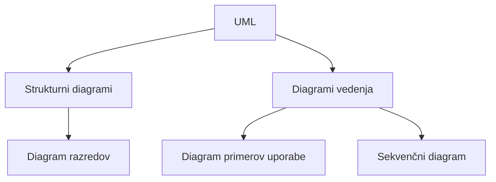

---
tags:
  - racunalnistvo
  - uml
---

# UML - pregled

Prej: [[01 Zahteve in uporabniške zgodbe|zahteve in uporabniške zgodbe]]. Naprej: [[03 UML - diagram primerov uporabe|diagram primerov uporabe]].

**UML** (Unified Modeling Language) je grafični modelirni jezik: skupen način, kako s *skicami* (diagrami) opišemo programsko opremo, še preden jo napišemo. Vsak diagram pokaže sistem z drugega zornega kota, zato jih je več vrst.

## Dve glavni skupini

| Skupina | Angleško | Kaj pokaže |
|-|-|-|
| Strukturni diagrami | Structure Diagrams | iz **česa** je sistem sestavljen |
| Diagrami vedenja (obnašanja) | Behavior Diagrams | **kaj sistem počne** in kako se obnaša |

## Skica: delitev diagramov

## Diagrami v teh zapiskih

| Diagram | Angleško | Skupina | Na kaj odgovarja | Zapisek |
|-|-|-|-|-|
| Diagram primerov uporabe | Use Case Diagram | vedenje | Kaj lahko uporabnik naredi s sistemom? | [[03 UML - diagram primerov uporabe]] |
| Sekvenčni diagram (diagram poteka zaporedij) | Sequence Diagram | vedenje | V kakšnem vrstnem redu si sledijo sporočila? | [[04 UML - sekvenčni diagram]] |
| Diagram razredov | Class Diagram | struktura | Kateri razredi so in kako so povezani? | [[05 UML - diagram razredov]] |

Poenostavljena pot od ideje do kode: zahteve → uporabniške zgodbe → diagram primerov uporabe → sekvenčni diagram → diagram razredov → koda.

> [!info] Kaj je iz predavanj
> Delitev na dve skupini in imena treh diagramov so iz zapiskov s predavanj. Razlage, zapis (notacija) in primer »knjižnica« so dodani za lažje učenje; primer je izmišljen.

> [!note] Drugi diagrami (niso del predavanj)
> Strukturni so še npr. diagram objektov (object), komponent (component) in razmestitve (deployment). Vedenjski so še npr. diagram aktivnosti (activity), stanj (state machine) in komunikacije (communication).

## Slovarček

| Slovensko | Angleško |
|-|-|
| zahteve | requirements |
| funkcijske / nefunkcijske zahteve | functional / non-functional requirements |
| uporabniška zgodba | user story |
| strukturni diagrami | structure diagrams |
| diagrami vedenja | behavior diagrams |
| diagram primerov uporabe | use case diagram |
| akter | actor |
| primer uporabe | use case |
| sekvenčni diagram | sequence diagram |
| življenjska črta | lifeline |
| sporočilo | message |
| diagram razredov | class diagram |
| razred | class |
| atribut | attribute |
| metoda (operacija) | method (operation) |
| povezava (asociacija) | association |
| kratnost | multiplicity |
