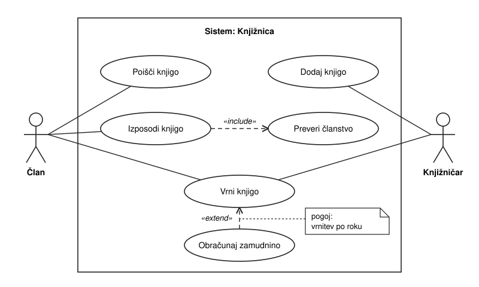

---
tags:
  - racunalnistvo
  - uml
---

# UML - diagram primerov uporabe

Prej: [[02 UML - pregled|pregled]]. Naprej: [[04 UML - sekvenčni diagram|sekvenčni diagram]].

**Diagram primerov uporabe** (Use Case Diagram) spada med [[02 UML - pregled|diagrame vedenja]] in opisuje **interakcijo med uporabnikom in sistemom**: kdo lahko kaj dela s sistemom. Ne pokaže, *kako* sistem to naredi znotraj, in ne pokaže vrstnega reda korakov (za to je [[04 UML - sekvenčni diagram|sekvenčni diagram]]).

## Gradniki

| Gradnik | Angleško | Kako ga narišemo | Pomen |
|-|-|-|-|
| Akter | Actor | človeška figura (lutka) z imenom | oseba ali zunanji sistem, ki uporablja sistem; je *vloga* iz uporabniške zgodbe |
| Primer uporabe | Use Case | elipsa z imenom (glagol + predmet) | ena stvar, ki jo sistem nudi akterju; je *cilj* iz uporabniške zgodbe |
| Meja sistema | System boundary | pravokotnik okoli primerov uporabe, ime sistema zgoraj | kaj je znotraj sistema; akterji so zunaj |
| Povezava | Association | polna črta med akterjem in primerom uporabe | akter sodeluje v tem primeru uporabe |

## Skica: knjižnica



Član išče, izposoja in vrača knjige. Knjižničar sprejme vrnitev in dodaja knjige.

## include in extend

| | «include» (vključitev) | «extend» (razširitev) |
|-|-|-|
| Kako narišemo | črtkana puščica z odprto konico | črtkana puščica z odprto konico |
| Puščica gre | od **osnovnega** k **vključenemu** primeru | od **razširitve** k **osnovnemu** primeru |
| Kdaj se zgodi | **vedno** (kot klic podprograma) | **včasih**, pod pogojem (pogoj zapišemo v opombi) |
| Osnovni primer | brez vključenega ni popoln | deluje tudi brez razširitve |
| V skici | Izposodi knjigo → Preveri članstvo | Obračunaj zamudnino → Vrni knjigo |

## Postopek

1. Iz uporabniških zgodb izpiši vloge: to so **akterji**.
2. Iz zgodb izpiši cilje: to so **primeri uporabe**.
3. Okoli primerov nariši **mejo sistema**, akterje postavi zunaj nje.
4. Poveži vsakega akterja s primeri, ki jih uporablja.
5. Del, ki ga potrebuje več primerov, izloči z «include». Redek ali neobvezen del označi z «extend».

> [!example]- Urejljiva različica skice (Mermaid)
> Mermaid nima ustaljene vrste za diagram primerov uporabe (najnovejši ima le poskusno `usecase-beta`), zato je skica tu narejena kot diagram poteka: akter je okvir z oznako «actor», primer uporabe je zaobljen oval, meja sistema je okvir. Pri ročni risbi akterja nariši kot lutko, primer uporabe pa kot elipso.
>
> ```mermaid
> flowchart LR
>     clan["«actor»<br/>Član"]
>     knjiznicar["«actor»<br/>Knjižničar"]
>     subgraph sistem["Sistem: Knjižnica"]
>         isci(["Poišči knjigo"])
>         izposodi(["Izposodi knjigo"])
>         vrni(["Vrni knjigo"])
>         dodaj(["Dodaj knjigo"])
>         clanstvo(["Preveri članstvo"])
>         zamudnina(["Obračunaj zamudnino"])
>     end
>     clan --- isci
>     clan --- izposodi
>     clan --- vrni
>     vrni --- knjiznicar
>     dodaj --- knjiznicar
>     clan ~~~ dodaj
>     izposodi -. "«include»" .-> clanstvo
>     zamudnina -. "«extend»" .-> vrni
> ```

> [!question] Vaja
> Iz zgodb za bankomat nariši diagram primerov uporabe: akter Stranka, primera Dvigni denar in Preveri stanje. Kaj je tu «include»? Namig: preverjanje PIN-a.

## Viri

- [UML Use Case Include](https://www.uml-diagrams.org/use-case-include.html) in [UML Use Case Extend](https://www.uml-diagrams.org/use-case-extend.html): vrsta in smer puščice, pomen include in extend.
- [UML Use Case Diagrams](https://www.uml-diagrams.org/use-case-diagrams.html): uvrstitev med diagrame vedenja.
- Oblike gradnikov (lutka, elipsa, pravokotnik) niso iz teh virov, to je splošno znanje o UML.
