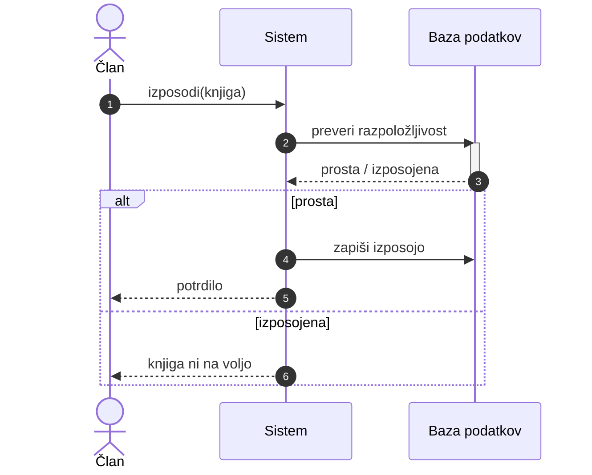

---
tags:
  - racunalnistvo
  - uml
---

# UML - sekvenčni diagram

Prej: [[03 UML - diagram primerov uporabe|diagram primerov uporabe]]. Naprej: [[05 UML - diagram razredov|diagram razredov]].

**Sekvenčni diagram** ali **diagram poteka zaporedij** (Sequence Diagram) spada med [[02 UML - pregled|diagrame vedenja]], natančneje med interakcijske diagrame. Pokaže, **v kakšnem vrstnem redu si sledijo sporočila** med udeleženci pri **enem scenariju**, npr. pri enem [[03 UML - diagram primerov uporabe|primeru uporabe]].

## Gradniki

| Gradnik | Angleško | Kako ga narišemo | Pomen |
|-|-|-|-|
| Udeleženec | Participant | pravokotnik z imenom na vrhu | kdo sodeluje (objekt, del sistema) |
| Akter | Actor | lutka na vrhu | uporabnik ali zunanji sistem |
| Življenjska črta | Lifeline | pravokotnik (»glava«) in od njega navpična, običajno črtkana črta navzdol | udeleženec skozi čas; **čas teče navzdol** |
| Sporočilo | Message | vodoravna puščica med življenjskima črtama | en klic ali odgovor |
| Sinhroni klic | Synchronous call | polna črta, **polna** konica | pošiljatelj počaka na odgovor |
| Asinhroni klic | Asynchronous call | **odprta** konica | pošiljatelj ne čaka |
| Odgovor | Reply | **črtkana** črta, odprta konica | vrnitev rezultata |
| Aktivacija | Activation | ozek pravokotnik na življenjski črti | udeleženec v tem času izvaja nalogo |
| Okvir | Combined fragment | okvir z oznako `alt`, `opt` ali `loop` | izbira (če ... sicer), neobvezen del, ponavljanje |

## Skica: izposoja knjige

> [!note] Puščice v skici
> Mermaid nariše vse puščice s polno konico, v UML pa ima odgovor odprto konico. Odgovor zato prepoznaš po črtkani črti.

### Kako brati

1. Član pokliče `izposodi(knjiga)` pri sistemu (sinhroni klic: polna črta, polna konica).
2. Sistem vpraša bazo, ali je knjiga prosta. Baza je, dokler obdeluje poizvedbo, **aktivna** (ozek pravokotnik).
3. Baza odgovori (črtkana črta).
4. `alt`: če je knjiga **prosta**, sistem zapiše izposojo (4) in potrdi članu (5).
5. Sicer (6) članu sporoči, da knjige ni.

> [!question] Vaja
> Nariši sekvenčni diagram za primer Dvigni denar iz prejšnje vaje: Stranka, Bankomat, Banka. Kateri klic je sinhroni in kje je odgovor? Kam bi dal `alt` (premalo denarja na računu)?

## Viri

- [UML Sequence Diagrams](https://www.uml-diagrams.org/sequence-diagrams.html): življenjska črta, aktivacija, sekvenčni diagram kot najpogostejši interakcijski diagram.
- [UML Message](https://www.uml-diagrams.org/interaction-message.html): vrste puščic (polna konica, odprta konica, črtkani odgovor).
- Smer časa (navzdol) in okvirji `alt`, `opt`, `loop` niso iz teh virov, to je splošno znanje o UML.
