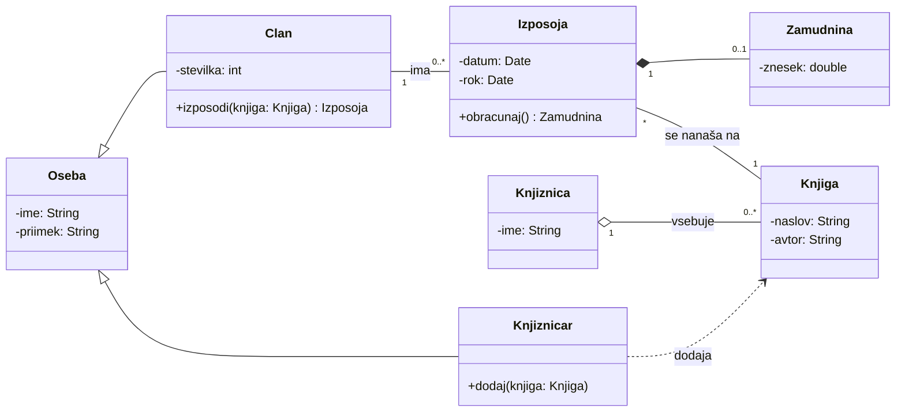

---
tags:
  - racunalnistvo
  - uml
---

# UML - diagram razredov

Prej: [[04 UML - sekvenčni diagram|sekvenčni diagram]]. Nazaj na [[02 UML - pregled|pregled]].

**Diagram razredov** (Class Diagram) je glavni diagram iz skupine [[02 UML - pregled|strukturnih diagramov]] (Structure Diagrams). Prikazuje razrede (objekte) v obliki tabel z **atributi**, **metodami** in **povezavami** med njimi.

Razred je predloga (npr. `Knjiga`), objekt je konkreten primerek (konkretna knjiga »Mali princ«).

## Razred

Pravokotnik, ki ga vodoravni črti razdelita na tri dele:

| Del | Vsebina | Primer |
|-|-|-|
| zgoraj | ime razreda (z veliko začetnico) | `Clan` |
| sredina | atributi (podatki) | `-stevilka: int` |
| spodaj | metode (operacije) | `+izposodi(knjiga: Knjiga): Izposoja` |

Imena atributov in metod pišemo z malo začetnico. Pred njimi je znak **vidnosti** (visibility):

| Znak | Pomen |
|-|-|
| `+` | javno (public) |
| `-` | zasebno (private) |
| `#` | zaščiteno (protected) |
| `~` | paketno (package) |

## Povezave med razredi

| Povezava | Angleško | Kako jo narišemo | Pomen | V skici |
|-|-|-|-|-|
| Asociacija | Association | polna črta | razreda se poznata ali sodelujeta | Clan — Izposoja |
| Agregacija | Aggregation | polna črta, **prazen romb** ◇ pri celoti | »ima«: del lahko obstaja tudi sam | Knjiznica ◇— Knjiga |
| Kompozicija | Composition | polna črta, **poln (črn) romb** ◆ pri celoti | »je sestavljen iz«: del ne obstaja brez celote | Izposoja ◆— Zamudnina |
| Posplošitev (dedovanje) | Generalization | polna črta, **prazen trikotnik** pri splošnem razredu | »je vrsta« | Clan je Oseba |
| Odvisnost | Dependency | **črtkana** puščica od odvisnega k tistemu, od katerega je odvisen | »uporablja« (npr. kot parameter metode) | Knjiznicar ⇢ Knjiga |
| Realizacija | Realization | črtkana črta s praznim trikotnikom, od razreda k vmesniku | razred izvaja vmesnik (interface) | ni v skici |

### Kratnost (Multiplicity)

| Zapis | Pomen |
|-|-|
| `1` | natanko eden |
| `0..1` | nič ali eden |
| `*` (tudi `0..*`) | nič ali več |
| `1..*` | vsaj eden |

Številka ob razredu pove, koliko primerkov **tega** razreda je povezanih z enim primerkom drugega razreda.

## Skica: knjižnica



### Kako brati

- `Clan` in `Knjiznicar` **dedujeta** od `Oseba` (trikotnik je pri `Oseba`).
- Član ima 0 ali več izposoj, izposoja ima natanko enega člana in natanko eno knjigo.
- Knjižnica **vsebuje** knjige (agregacija): knjiga obstaja tudi brez te knjižnice.
- Zamudnina je del izposoje (kompozicija): brez izposoje ne obstaja, izposoja pa ima 0 ali 1 zamudnino.
- Knjižničar **uporablja** knjigo, ko jo dodaja (odvisnost).

### Kako se diagram vidi v kodi (Python)

Izsek za `Oseba`, `Clan` in `Izposoja`:

```python
class Oseba:
    def __init__(self, ime, priimek):
        self._ime = ime                 # -ime
        self._priimek = priimek         # -priimek


class Clan(Oseba):                      # trikotnik: Clan je vrsta Oseba
    def __init__(self, ime, priimek, stevilka):
        super().__init__(ime, priimek)
        self._stevilka = stevilka       # -stevilka
        self.izposoje = []              # povezava: 1 član, 0..* izposoj

    def izposodi(self, knjiga):         # +izposodi(knjiga): Izposoja
        izposoja = Izposoja(self, knjiga)
        self.izposoje.append(izposoja)
        return izposoja


class Izposoja:
    def __init__(self, clan, knjiga):
        self.clan = clan                # vsaka izposoja ima natanko 1 člana
        self.knjiga = knjiga            # in natanko 1 knjigo
```

> [!question] Vaja
> Za bankomat nariši diagram razredov: Stranka, Racun, Kartica, Bankomat. Določi povezave in kratnosti, npr. koliko računov ima lahko ena stranka.

## Viri

- [UML Class Diagrams Reference](https://www.uml-diagrams.org/class-reference.html): deli razreda, vidnost, agregacija, kompozicija, posplošitev, odvisnost, realizacija, kratnost.
- Slog črt pri posplošitvi (polna) in realizaciji (črtkana) ter pomen »ima« in »je sestavljen iz« niso dobesedno iz tega vira, to je splošno znanje o UML.
